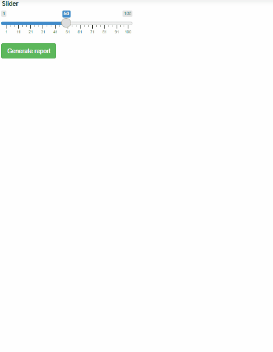

## Using a Shiny app for passing in more dynamic parameters to render an rmarkdown document

### Reference

This project is using the code from: [https://www.r-bloggers.com/2021/06/shiny-inception-javascript-in-rendered-markdown/](https://www.r-bloggers.com/2021/06/shiny-inception-javascript-in-rendered-markdown/)

### Purpose

This simple example shows how to trigger rendering of a parameterized rmarkdown from inside a shiny app. This is useful because in some cases the user may not have access to the pre-loaded parameters to trigger rendering or the parameters themselves may need to be refreshed on demand. 

For more information on parameterized reports see: [https://docs.rstudio.com/connect/1.7.4/user/param-rmarkdown.html](https://docs.rstudio.com/connect/1.7.4/user/param-rmarkdown.html)

### Check it out 

View this app yourself at: [https://colorado.rstudio.com/rsc/Rmarkdown_Rendererer_Example/](https://colorado.rstudio.com/rsc/Rmarkdown_Rendererer_Example/)

This screenshot was taken in Chrome on 9/22/2022 using [https://github.com/NickeManarin/ScreenToGif](https://github.com/NickeManarin/ScreenToGif). 

### Additional References

 - https://davidruvolo51.github.io/shinytutorials/tutorials/rmarkdown-shiny/ 
 - https://stackoverflow.com/questions/34816637/parameterized-rmarkdown-document-on-shiny-application
 - https://shiny.rstudio.com/articles/generating-reports.html 
 - https://shiny.rstudio.com/reference/shiny/1.6.0/varSelectInput.html
 - https://community.rstudio.com/t/shiny-selectinput-to-get-list-from-a-dataframe-column/89736/5
 - https://shiny.rstudio.com/reference/shiny/1.0.1/observeEvent.html
 - https://www.rstudio.com/resources/rstudioconf-2018/parameterized-r-markdown-reports-with-rstudio-connect/
 - https://www.r-bloggers.com/2021/06/shiny-inception-javascript-in-rendered-markdown/
